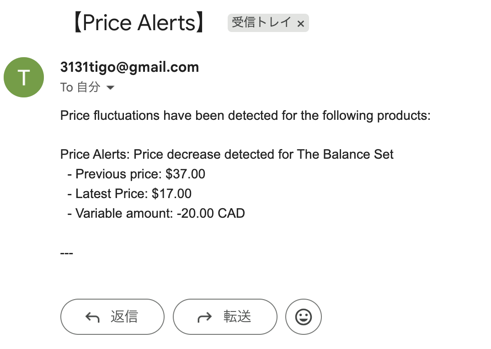

# 競合価格自動追跡システム
The Ordinaryの競合価格を監視し、変動をGmailで即時通知するPythonによる自律型データパイプライン構築プロジェクト。

## 📸 デモンストレーション

---

## 🧐 開発背景
この「競合価格自動追跡システム」の開発は、市場の価格競争が激化する現代において、企業が直面する手動データ収集プロセスの非効率性と、それによる市場対応の遅れという重大な課題を解決するために着想されました。

1. 解決すべき課題：時間と人的リソースの浪費
  * 手動によるコスト: 競合他社のECサイトや販売プラットフォームを定期的にチェックし、価格情報を記録・集計する作業は、時間と人的リソースを大きく浪費していました。
  * 遅延する市場対応: 手動での集計・分析は、価格変動の発生からデータが戦略部門に届くまでにタイムラグを生じさせます。この遅延により、自社の価格戦略を市場の動きに合わせて迅速に変更することが不可能となっていました。
    
2. 解決策：自律型データパイプラインによる即時戦略提供
このプロジェクトは、Pythonスクリプトによる自律型データパイプラインを構築することで、上記の課題を根底から解決しました。
  * 一気通貫の自動化: Webスクレイピングによるデータの自動収集、pandasを用いた構造化された履歴データとの高速比較分析、そして閾値を超えた変動を検知した際の**外部通知（Gmail）**までを、すべてPythonスクリプト内で一気通貫で自動化しています。
  * 戦略的洞察の即時提供: この自動システムにより、競合の価格変動をリアルタイムに近い速さで検知し、その分析結果を関係者に即座に通知することが可能となりました。これにより、人的リソースをデータ入力ではなく戦略立案に集中させることができ、市場の変化に対する迅速かつデータドリブンな対応（価格調整、プロモーション開始など）を実現します。

---

## 🛠️ 技術スタックと実装のポイント
* 言語: Python 3.10+
* コアライブラリ: requests, BeautifulSoup4, pandas, smtplib

[実装のポイント]
1. アンチスクレイピング対策: HTTPヘッダーにUser-Agentを設定し、ボットと認識されることを回避。
2. 堅牢なデータ抽出: Webサイト固有のHTML属性 (content) から直接価格データを抽出し、抽出ロジックの安定性を確保。
3. データパイプライン: pandas.concat と pandas.merge を使用し、履歴の追記と最新データとの高速比較を実現。
4. セキュリティ連携: Gmail通知に際し、アプリパスワードとSMTP/SSL接続を採用し、認証情報の安全性を確保。

---

## 📊 アウトプットと実行
### 価格履歴の永続化 (price_history.csv)
実行履歴はCSVファイルに時系列で保存されます。これにより、価格推移のグラフ化や詳細分析が可能になります。
> 上記データでは、PROD003で設定閾値（$1.00）を超える値下げを検知するように調整されています。

### 自動通知イメージ(Gmail通知)
【Price Alerts】

### 実行環境
BeautyPriceTracker.py を使用し、OSのタスクスケジューラ（Windows Task Scheduler / macOS Cron/launchd）に登録することで、定期的な監視と自動実行を実現しています。

---
----- **English Version** -----

# Beauty Price Tracker (Automated Competitor Pricing System)
An autonomous Python data pipeline project designed to monitor competitor pricing on e-commerce sites (The Ordinary) and deliver instant notifications via Gmail upon detecting price changes.

## 📸 Demonstration

---

## 🧐 Development Background
The development of this "Competitive Price Tracking System" was conceived to solve critical problems faced by businesses in today's intense market competition: the inefficiency of manual data collection processes and the resulting delay in market responsiveness.

1. The Challenge: Waste of Time and Human Resources
  * The traditional process for monitoring competitor pricing hindered quick business decision-making, primarily due to the following issues:Manual Costs: The repetitive task of checking competitor e-commerce sites and sales platforms, recording prices, and consolidating the information consumed significant time and human resources.
  * Delayed Market Response: Manual collection and analysis introduced a time lag between a price change occurring and the data reaching the strategy department. This delay made it impossible to rapidly adjust the company's pricing strategy in alignment with market dynamics.

2. The Solution: Autonomous Data Pipeline for Immediate Strategic Insight
This project fundamentally solved the above challenges by building an autonomous data pipeline using Python scripts.
  * End-to-End Automation: The entire process is automated within the Python script, encompassing Web Scraping for automatic data collection, high-speed comparative analysis against structured historical data using pandas, and external notification (Gmail) upon detecting fluctuations exceeding a set threshold.
  * Instant Strategic Insight: This automated system allows for the near-real-time detection of competitor price changes. The analysis is immediately communicated to stakeholders, enabling human resources to focus on strategic planning rather than data entry. This results in rapid and data-driven responses to market changes (e.g., price adjustments, launching promotions).

---

## 🛠️ Key Technologies & Implementation
* Language: Python 3.10+
* Core Libraries: requests, BeautifulSoup4, pandas, smtplib

[Implementation Highlights]
1. Anti-Scraping Measures: Configured User-Agent headers within requests to mitigate bot detection.
2. Robust Data Extraction: Specifically targeted and extracted price data from HTML attributes (content) for stability across site updates.
3. Data Pipeline: Utilized pandas.concat for historical data appending and pandas.merge for efficient change detection.
4. Secure Integration: Employed Gmail App Passwords and SMTP/SSL for secure and verified external notification functionality.

---

## 📊 Output & Deployment
### Historical Data Persistence
Execution history is saved chronologically in a CSV file, enabling detailed analysis and visualization.
> The above data is configured to show a price decrease exceeding the $1.00 threshold for PROD003.

### Automated Notification Example(Gmail Notification)
【Price Alerts】

### Execution Environment
The system is registered with the OS's Task Scheduler (Windows/macOS) to achieve scheduled, autonomous monitoring.
